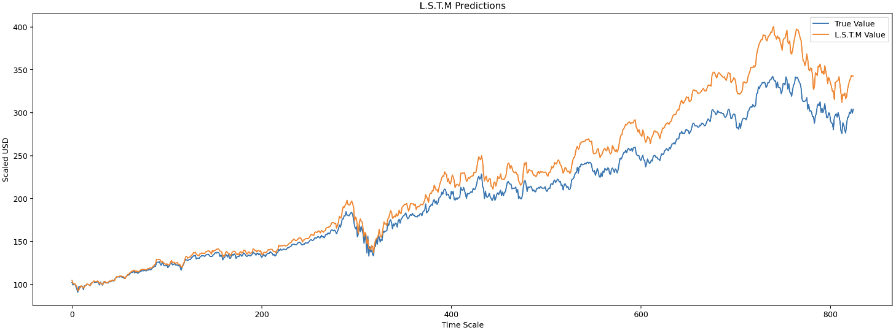

# Stock Closing Price Forecast

### The Dataset

This app uses a machine learning model to predict today's closing price of a given stock. The model is trained on historical data of the Microsoft stock (NYSE: MSFT), starting when the company went public in 1986 to March of 2022.

Below is a sneak peek of the dataset used to train the model:

In this dataset, `Open`, `High`, `Low`, and `Close` are the opening, highest, lowest, and
closing prices of the stock on a given day. `Volume` is the number of shares traded on that
day. `Adj Close` is the closing price adjusted for stock splits and dividends.

### The Model

The model is a Long Short-Term Memory (LSTM) neural network. It is a type of recurrent neural
network (RNN) that is able to remember information from previous time steps. LSTM is widely
used to analyze time-series data, such as stock prices, because it allows the model to learn
from past data to make predictions about future data.

The dataset is split 90:10 into training and testing data, respectively. The model is trained
on the training data and then tested on the testing data. The graph below shows the model's
predictions on the testing data. The blue line is the actual closing price of the stock, and
the orange line is the predicted closing price of the stock.

This graph provides us a sense of the model's accuracy. At the moment, the model is able to
predict the general trend of the stock's closing prices but overestimates the magnitude of
the price changes. We will continue to fine-tune the model in the future.

## Predictions

Using `Streamlit`, we created a dashboard interface where you can predict the closing price of select stocks in real-time:

**TODO: include the link to the Streamlit Cloud app if we can set it up on time. Otherwise, include instructions on how to set up the app locally**

### Side Note: Running this App Locally using MacOS with M1 Chip

1. Clone this repository
2. Install TensorFlow and the tensorflow-metal PluggableDevice on your machine following [these instructions](https://developer.apple.com/metal/tensorflow-plugin/)
3. In the terminal, `cd` to this project's directory
4. Create a new conda environment with `conda create --name myenv` (where `myenv` is the name of your new environment)
5. Activate the environment with `conda activate myenv`
6. Run `while read requirement; do conda install --yes $requirement || pip install $requirement; done < requirements.txt`. This command will install all the packages listed in `requirements.txt` using conda if possible, otherwise it will use pip
7. Create a file to track packages installed with conda vs pip: `conda env export > environment.yml`
8. Verify that the new environment was installed correctly: `conda env list` or `conda info --envs`
9. In VS Code, open the `model.ipynb` file and change to the kernel associated with your conda environment `myenv`
10. When running the first block that imports packages, you may get a prompt that asks you to install supporting jupyter extensions. Click "Install" and restart VS Code

If you encounter `ERROR: Failed building wheel for h5py` during this process, follow the top answer in [this StackOverflow thread](https://stackoverflow.com/questions/70587971/errorfailed-building-wheel-for-h5pyfailed-to-build-h5pyerrorcould-not-build-wh).
